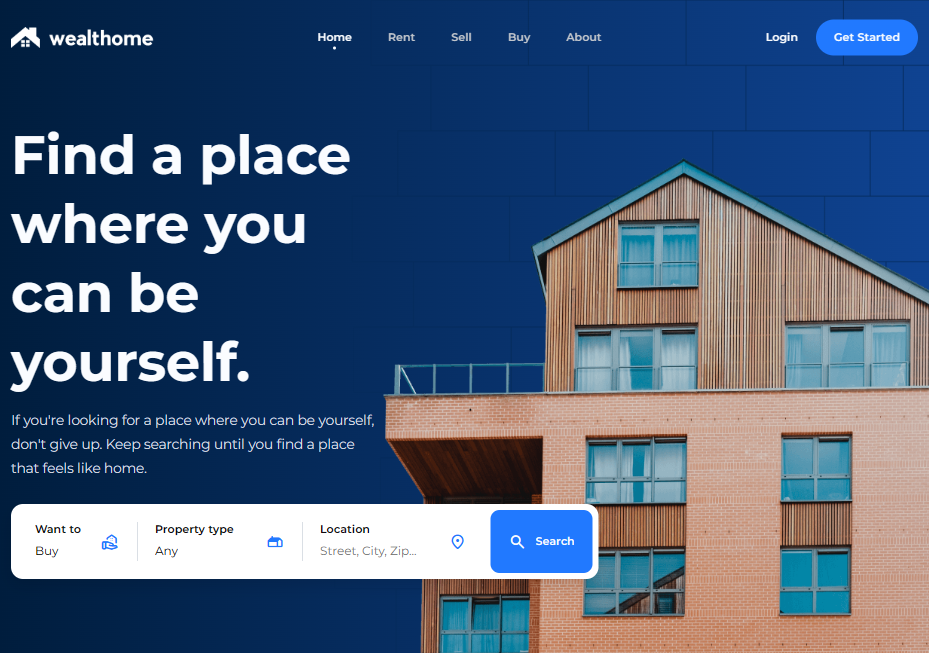

# 🏡 Wealthome – Real Estate Website

## 📌 Overview

**Wealthome** is a modern real estate website designed to help users explore, discover, and learn more about properties in an elegant and user-friendly interface. The website focuses on delivering a smooth browsing experience with visually appealing layouts and structured content.

🔗 **Live Demo:**
[https://hadeeraltabaa.github.io/Wealthome/](https://hadeeraltabaa.github.io/Wealthome/)

---

## ✨ Features

* 🏠 Clean and modern homepage design
* 🔍 Property browsing experience
* 📱 Responsive layout for different screen sizes
* 🎯 User-friendly navigation
* 💡 Well-structured sections for showcasing real estate content

---

## 🛠️ Technologies Used

* **HTML5** – Structure of the website
* **CSS3** – Styling and layout
* **JavaScript** – Interactive elements

---

## 📂 Project Structure

```
Wealthome/
│── index.html
│── /css
│── /js
│── /images
```

---

## 🎯 Purpose

This project was created as part of a learning journey in web development to practice:

* Frontend design principles
* Responsive layouts
* Structuring real-world web applications

---

## 📸 Screenshots



---

## 📌 Future Improvements

* Add backend functionality for dynamic property listings
* Implement user authentication
* Add search and filter features
* Improve accessibility and performance

---

## 👩‍💻 Author

**Hadeer Altabaa**

* GitHub: [https://github.com/hadeeraltabaa](https://github.com/hadeeraltabaa)
